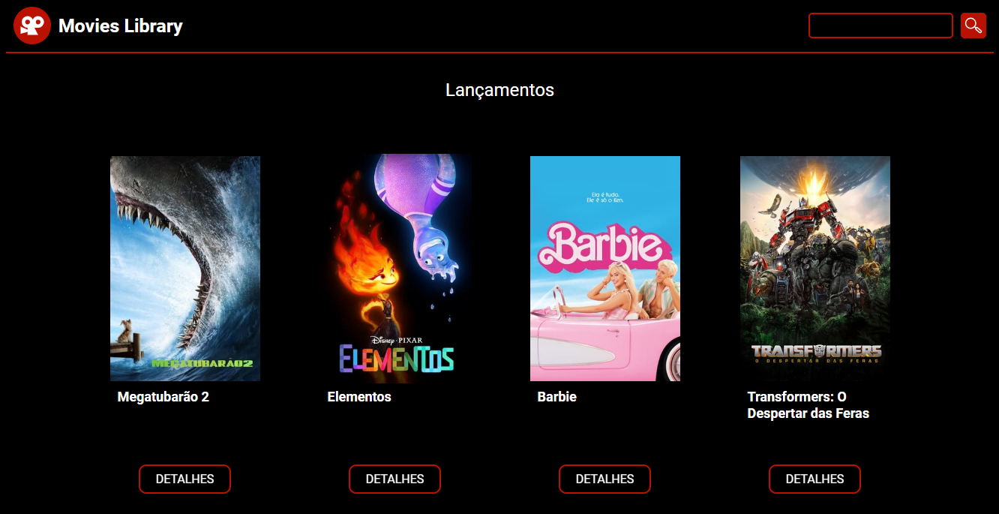

# Movies Database 🎞️

Um site de filmes, que utiliza a API do [TMDB (The movie db)](https://developer.themoviedb.org/reference/intro/getting-started) para listar os filmes com vários filtros diferentes.

Funcionalidades inclusas:

- Pesquisar filme pelo nome
- Filmes por categoria
- Filmes lançados recentemente
- Filmes Populares
- Filmes Mais votados

# Tecnologias usadas

- Javascript (React) 
- Styled Components (estilização)
- Typescript

## Autor

- [@AbrahamLica](https://www.github.com/AbrahamLica)  👈

## Social
- [Perfil Linkedin ](https://www.linkedin.com/in/abraham-melquisedeque-pereira-lic%C3%A1-0a1736203/) 👈

<h3>Screenshot</h3>

